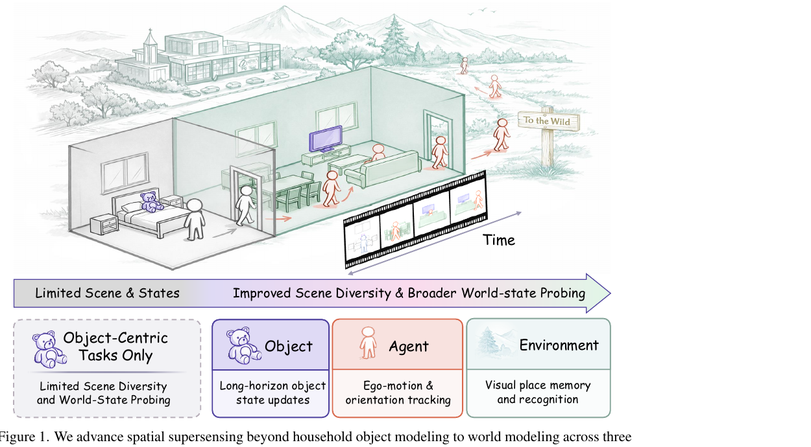
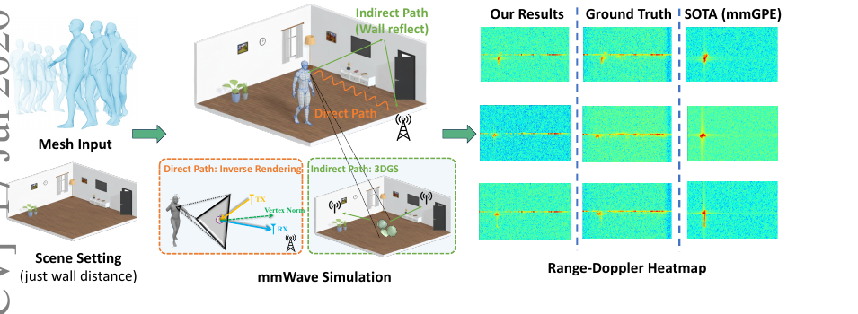

# Chua Kok Chung

Computer science researcher working on **spatial intelligence, multimodal sensing, and embodied AI for healthcare robotics**.

I am currently a **Research Intern at [LycheeAI / Litchi Lab Humanoid Group](https://github.com/Lychee-AI-Humanoid-Group)** under the supervision of **[Prof. Yiming Li](https://yimingli-page.github.io/)**. I am completing a B.Eng. (Honours) in Computer Science and Technology at Xiamen University Malaysia.

My long-term goal is to develop general-purpose humanoid robots that can understand physical spaces, recognise human needs, and support healthcare and nursing work safely and naturally.

## My research perspective

### What I study

I study how intelligent systems can build and update an understanding of people, objects, and places over time. My work connects long-form visual reasoning with WiFi and mmWave human sensing.

### Why it matters

Healthcare and nursing environments are dynamic, crowded, and difficult to sense reliably. Useful robots must reason through viewpoint changes, occlusion, unfamiliar spaces, and incomplete observations—not only perform well in controlled benchmarks.

### How I plan to pursue it

1. **Persistent spatial world models** — representations that preserve identity, geometry, and state across long sensory streams.
2. **Complementary multimodal sensing** — understanding when vision, WiFi, and mmWave signals can compensate for one another.
3. **Embodied validation** — grounding spatial representations in humanoid tasks and evaluating reliability, generalisation, and practical value.

## Selected publications

### [Towards Spatial Supersensing in the Wild](https://arxiv.org/abs/2607.13681) — ECCV 2026

[Project page](https://vsi-super-wild.github.io/) · [Paper](https://arxiv.org/abs/2607.13681)

Introduces VSI-Super-Wild, a benchmark for coherent spatial reasoning over long, real-world video. Its 442 videos and 6,980 verified question-answer pairs probe world state across the agent, objects, and environment.

### [HybridSim: A Physics-Learning Hybrid Digital Twin for mmWave Human Sensing](https://arxiv.org/abs/2607.15806) — ECCV 2026

[Project page](https://weitao-xiong.github.io/HybridSim/) · [Paper](https://arxiv.org/abs/2607.15806)

Combines inverse rendering for direct reflections with 3D Gaussian Splatting for site-specific multipath, enabling realistic radar-signal synthesis from dynamic human meshes.

### [WiFi-Based Human Activity Recognition and Fall Detection with Taxonomy, Benchmarks, and Future Directions](https://ojs.bonviewpress.com/index.php/AIA/article/view/7517/2101) — Artificial Intelligence and Applications, 2026

Reviews 26 studies with emphasis on deployment beyond controlled laboratories, identifying cross-environment robustness, public data, and reproducible benchmarking as central gaps.

## Questions I hope to discuss with the research community

- How can a model maintain a coherent world state over long, continuous experience?
- Which multimodal representations best connect spatial reasoning to embodied action?
- How should spatial intelligence be evaluated when the final goal is safe, useful assistance?

## Connect

If our interests overlap, I would value the opportunity to learn about your work and exchange ideas.

[purpleginseng1@gmail.com](mailto:purpleginseng1@gmail.com)
